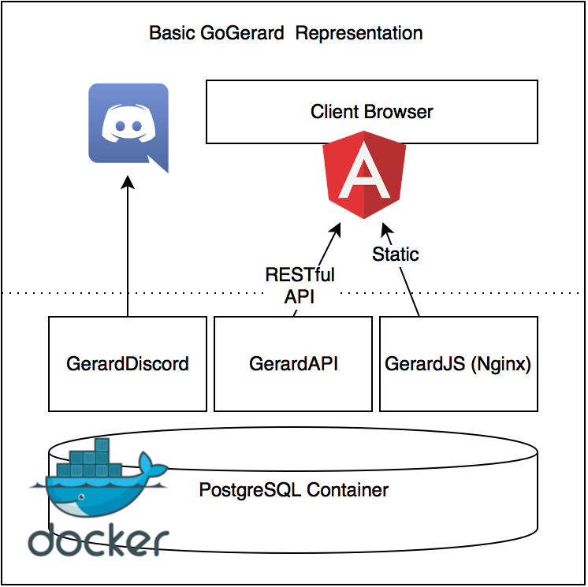

# GoGerard
GoGerard's Main Repository

----------

----------
GoGerard is an opensource project that focuses on easy to adapt, community-driven chatbots for [Discord](https://discordapp.com/).

The application is written in three separated parts, which are all replaceable with your own solution, to adapt to your project's needs.
It's basically a full solution for your Discord bot, but might also be partly useful for an already written bot or for your GerardIRC/GerardSMS project.

 - [GerardDiscord](https://github.com/GoGerard/GerardDiscord) - A client, written in Golang, that communicates with the Discord API and the PostgreSQL database.
 - [GerardAPI](https://github.com/GoGerard/GerardAPI) - An API Server, written in Golang, the communicator between the database and the web interface.
 - [GerardJS](https://github.com/GoGerard/GerardJS) - A web interface, powered by AngularJS.

#### NOTE:
Note that in the current state the project is nowhere finished, dependent on unstable external libraries, and will break your own project every day till a future release. The project hasn't been adapted to universal use, as it was developed for a very small community, and still contains some Dutch commands, weird content and Chinese cartoons.

----------

Project has currently the following working features:
- Unlimited (till server dies) Async (pizza) timers
- Return random string from file (deprecated)
- API token authentication
- NSFW protection (disable certain functions in certain channels) (Bad hack, future releases will replace this)
- Weird dutch functions, with jokes you won't understand. (Will certainly be removed)

The following features are at the moment not finished and only work with the current boundaries.
At the moment it is used to return a (random) picture from specified tags.
- Return Picture url from random table row.
- Return Picture urls from table
- Both features above, but only considering specified tag.
- Add, Delete and Update Pictures, Tags and their relations using a ok-ish secure web interface.

Future features:
- Making the Picture/Tag system more general purpose.
- Better authentication for better securing following features.
- Add, Delete and Update commands that rely on basic rule sets using a web interface.
- Server/Role Management
- Support for Discord invite system
- Your ideas

----------
### How to use?
Prerequisites: Docker, Docker-Machine, Docker-Compose and Git installed!

- Clone Repo
- (Windows) Run GitGoGerard.cmd
- Alternatively (if not on Windows), Git Clone the three repo's inside GoGerard folder.
- Fill in conf_sample.json, rename to conf.json and put in GerardDiscord folder
- Edit Postgres password in docker-compose.yml
- Change api_prefix in `GerardJS/assets/js/app.js` to server IP as seen by the client (So only localhost:8080 or dockermachineip:8080 if the interface is being used locally)
- Run `docker-compose up` in properly set up terminal (eq. `docker version` returns server information)
- Wait for the images to download and build
- GoGerard automatically starts.
- CTRL+C exits GoGerard
- Rerunning `docker-compose up` restarts already built containers in less than a couple seconds.
- NOTE: Removing the postgres container will remove all saved SQL data. 

----------
##Please contribute

You can always contribute using pull requests, discuss ideas and bugs using the Github Issues page, or say something to me on the [Unofficial API development server on Discord](https://discordapp.com/invite/0SBTUU1wZTVyGXpr).

Feel free to change, and adapt the code as you like. I'd like to see the results.
